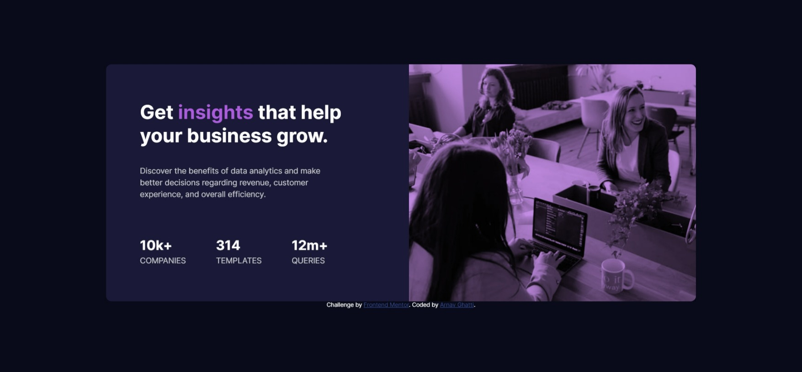

# Frontend Mentor - Stats preview card component solution

This is a solution to the [Stats preview card component challenge on Frontend Mentor](https://www.frontendmentor.io/challenges/stats-preview-card-component-8JqbgoU62). Frontend Mentor challenges help you improve your coding skills by building realistic projects. 

## Table of contents

- [Overview](#overview)
  - [The challenge](#the-challenge)
  - [Screenshot](#screenshot)
  - [Links](#links)
- [My process](#my-process)
  - [Built with](#built-with)
  - [What I learned](#what-i-learned)
  - [Useful resources](#useful-resources)
- [Author](#author)
- [Acknowledgments](#acknowledgments)

**Note: Delete this note and update the table of contents based on what sections you keep.**

## Overview

### The challenge

Users should be able to:

- View the optimal layout depending on their device's screen size

### Screenshot



### Links

- Solution URL: [https://github.com/Arnav-Ghatti/Stats-Preview-Card](https://github.com/Arnav-Ghatti/Stats-Preview-Card)
- Live Site URL: [https://arnav-ghatti.github.io/Stats-Preview-Card/](https://arnav-ghatti.github.io/Stats-Preview-Card/)

## My process

### Built with

- Flexbox
- Mobile-first workflow

### What I learned

I learnt blending modes in css which I didn't even know existed. I also learnt about media queries for the responsiveness of the website

```css
.overlay {
    width: 550px;
    height: 100%;
    position: absolute;
    top: 0;
    bottom: 0;
    left: 0;
    right: 0;
    background-color: #aa5cdbb3;
    mix-blend-mode: multiply;
}
```

### Useful resources

- [CSS Blend Modes](https://www.youtube.com/watch?v=-c94pr41jaI) - Helped me in adding the overlay effect over the image.

## Author

- Frontend Mentor - [@Arnav-Ghatti](https://www.frontendmentor.io/profile/arnav-ghatti)

## Acknowledgments

NOTE: The code under the media queries in style.css is really messy and i didn't clean it up becuase I was tired and didn't want, please bear with me.
